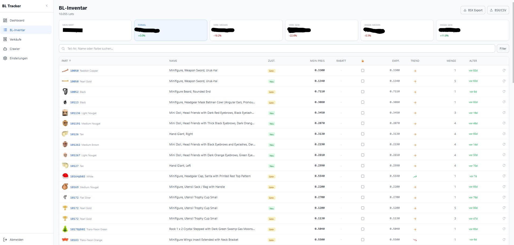
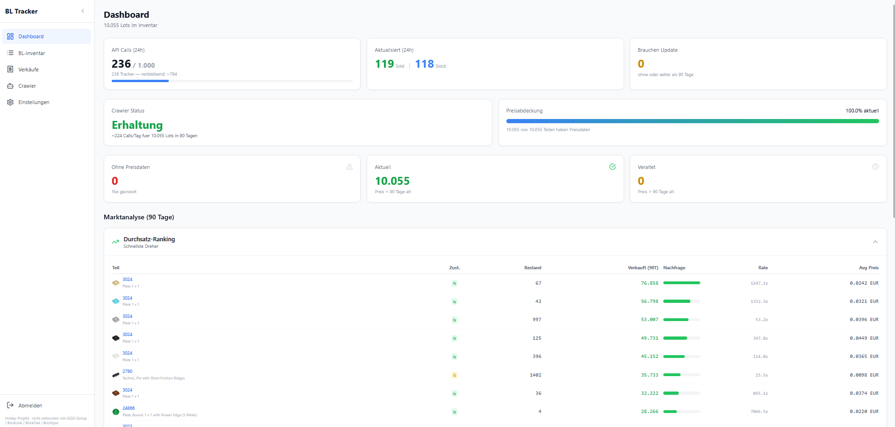
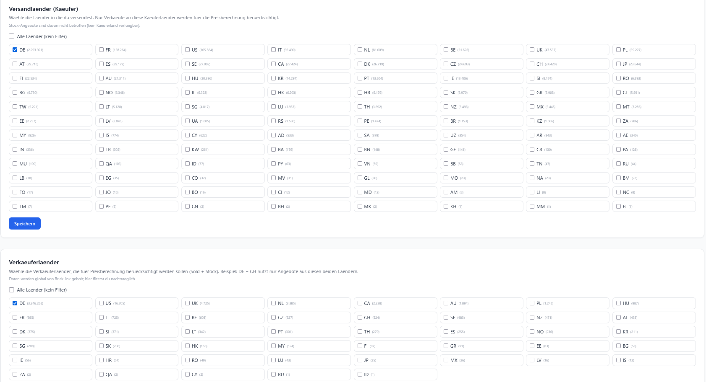
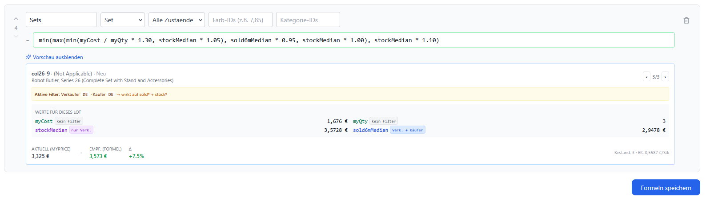
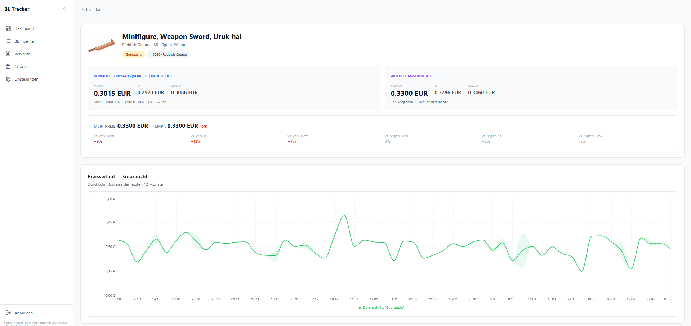
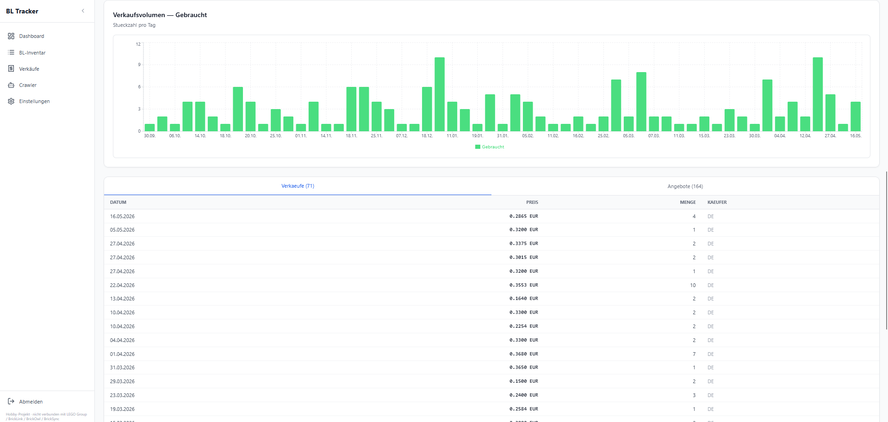
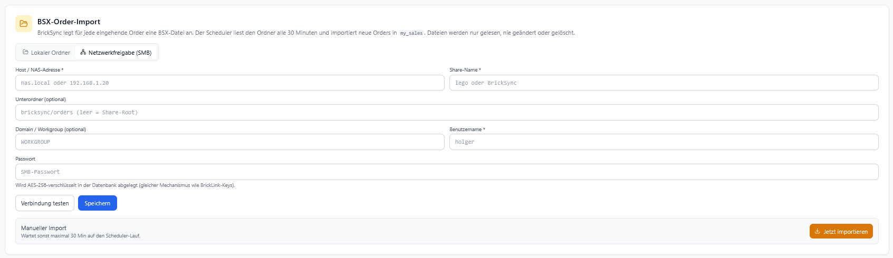
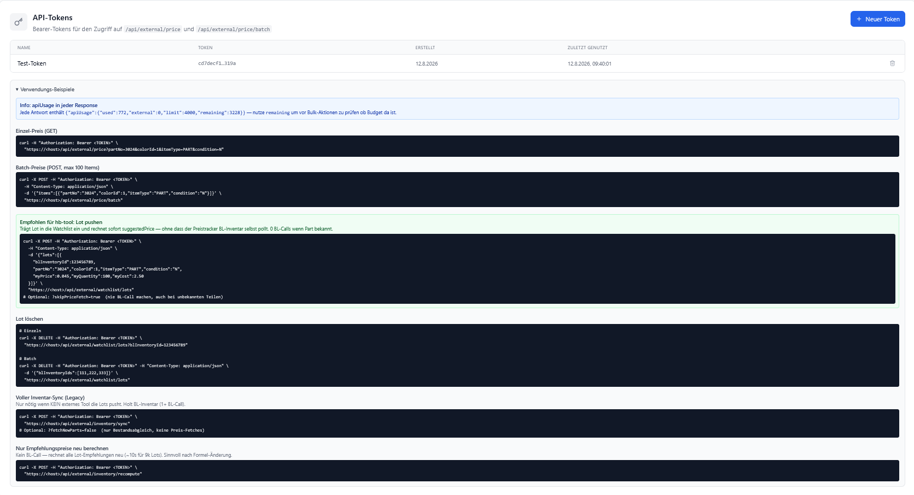

# BrickLink Price Tracker

> **Privates Hobby-Projekt, per Vibe-Coding mit KI-Unterstützung entstanden.** Steht in keiner Verbindung zur **LEGO Group**, **BrickLink Limited**, **BrickOwl LLC** oder **BrickSync**. LEGO®, BrickLink® und BrickOwl® sind eingetragene Marken der jeweiligen Rechteinhaber, die dieses Projekt weder unterstützen noch autorisieren. Nutzung auf eigene Verantwortung — siehe [NOTICE.md](./NOTICE.md).

Ein selbstgehostetes Web-Tool, das deinem BrickLink-Store hilft, **faire und wettbewerbsfähige Preise** zu setzen. Es holt sich täglich echte Marktdaten von BrickLink (was aktuell angeboten wird und was tatsächlich verkauft wurde) und rechnet dir daraus Preisempfehlungen für jedes Teil in deinem Lager aus — nach Regeln, die du selbst festlegst.

Gebaut für kleine bis mittlere LEGO-Händler, die **datenbasiert** verkaufen wollen, ohne stundenlang manuell Preise zu recherchieren.

**Nichts wird zurück an BrickLink oder BrickOwl geschrieben.** Das Tool liest nur — Änderungen exportierst du als BSX, prüfst sie in BrickStore und lädst sie manuell hoch. So kann nichts kaputt gehen.




---

## Was das Tool für dich macht

- **Preise beobachten:** Holt für jedes Teil in deinem Lager, was Konkurrenten aktuell dafür verlangen und zu welchen Preisen es tatsächlich verkauft wurde (6 Monate Historie)
- **Empfehlungspreise ausrechnen:** Wendet deine eigenen Formeln an (z.B. "5% unter dem Marktmedian" oder "10% Aufschlag auf den 90-Tage-Verkaufsdurchschnitt")
- **Länder filtern:** Auf Wunsch nur Verkäufer/Käufer aus bestimmten Ländern berücksichtigen (z.B. nur DE-Verkäufer für den deutschen Markt)
- **Deine Verkäufe tracken (optional):** BSX-Order-Dateien aus BrickSync/BrickStore reinschieben — per Ordner-Scan, SMB-Share oder manuellem Upload — und du kriegst KPI-Karten, 12-Monats-Chart und Top-10-Teile. Wenn du die Sales-Übersicht nicht brauchst, kannst du diesen Teil komplett ignorieren
- **Als BSX exportieren:** 1:1-Kopie deines Bestands mit den neuen Empfehlungspreisen — direkt in BrickStore importierbar
- **REST-API:** Bearer-Token-Endpoints für externe Tools (Inventar-Manager, Automatisierungen). Details in [API.md](./API.md)

## Für wen es sich lohnt

Wenn du…
- einen BrickLink-Store mit vielen Teilen hast und Preise nicht mehr manuell pflegen willst
- eine eigene Preisstrategie hast, die du konsistent auf alle Lots anwenden möchtest
- wissen willst, welche Teile gerade heiß laufen und welche liegenbleiben
- BrickStore für Uploads nutzt

…dann ist das dein Tool. Wenn du 20 Teile im Store hast, ist der Aufwand für Setup zu hoch — mach das dann lieber händisch.

---

## Was du vorbereiten musst

Bevor du loslegst:

1. **Einen Server** — dein eigener Linux-PC, ein Mini-PC daheim, oder ein günstiger VPS. Braucht: 2 GB RAM, 20 GB Platte, Docker installiert
2. **Einen BrickLink-Account** mit aktivierten API-Credentials — [Anleitung bei BrickLink](https://www.bricklink.com/v3/api.page). Du brauchst am Ende 4 Werte: Consumer Key, Consumer Secret, Access Token, Access Token Secret
3. **~15 Minuten** für Setup + erste Konfiguration

---

## Installation

### One-Command-Install (empfohlen)

Auf einem frischen Ubuntu- oder Debian-Server (z.B. bei Netcup, Hetzner, Contabo) — funktioniert genauso auf einem **Raspberry Pi 4/5** mit Raspberry Pi OS (Debian-basiert):

```bash
apt update && apt install -y curl
curl -fsSL https://raw.githubusercontent.com/rainman19121979/bl-price-tracker/main/scripts/install.sh | sudo bash
```

Das Docker-Image ist für `linux/amd64` UND `linux/arm64` gebaut — Docker zieht automatisch das richtige für deine Hardware.

> Warum die erste Zeile? Minimal-Installationen von Ubuntu 24 bringen `curl` nicht mehr per Default mit. Der Installer selbst installiert danach `git`, `iproute2` etc. automatisch nach — nur `curl` musst du kurz vorher haben, damit du den Installer überhaupt herunterladen kannst.

Der Installer macht alles automatisch:
- Prüft OS, RAM, Platte, Port-Konflikte (bricht ab bei Problemen — nichts wird "einfach so überschrieben")
- Installiert Docker falls fehlt
- Klont das Repo nach `/opt/bl-price-tracker`
- Erzeugt die drei Sicherheits-Secrets zufällig (kein Copy-Paste nötig)
- Erkennt eine bestehende **BrickSync-Installation** und bietet an, den Orders-Ordner einzubinden
- Fragt einmal nach dem Zugriffsmodus (Localhost via Tailscale, oder öffentlich via Caddy+HTTPS)
- Startet den kompletten Stack + wartet bis die App antwortet

**Was der Installer NICHT anfasst:** SSH-Config, Firewall (UFW), bestehende Web-Server, BrickSync-Dateien. Bei jedem Konflikt wird abgebrochen, damit du selbst entscheidest.

**Vorsichtig? Installer erst inspizieren, dann laufen lassen:**

```bash
curl -fsSL https://raw.githubusercontent.com/rainman19121979/bl-price-tracker/main/scripts/install.sh -o install.sh
less install.sh        # anschauen — ist kommentiertes Bash
sudo bash install.sh   # ausführen
```

> **Ein Merkzettel für später:** Nach der Installation sichere dir den `ENCRYPTION_KEY` aus `/opt/bl-price-tracker/.env` in einem Passwortmanager. Damit werden deine BrickLink-Zugangsdaten verschlüsselt — verlierst du ihn, musst du sie neu eintragen.

### Wie komme ich auf meine App? (nach der Installation)

Der Installer empfiehlt und richtet standardmäßig den **Localhost-Modus** ein — die App ist von außen unsichtbar. Für den Zugriff nutzt du **Tailscale** (kostenlos, 5-Min-Setup, sicherer als eigenes HTTPS):

**Auf dem VPS** (nach der Installation):
```bash
curl -fsSL https://tailscale.com/install.sh | sh
sudo tailscale up
# → Link im Browser öffnen, mit Google/GitHub/Microsoft-Account einloggen
```

**Auf deinem Laptop + Handy:**
1. [tailscale.com/download](https://tailscale.com/download) → App installieren
2. Mit demselben Konto einloggen
3. VPS-Tailscale-IP anzeigen: auf dem VPS `tailscale ip -4` (z.B. `100.64.1.5`)
4. Im Browser (egal wo du bist): `http://100.64.1.5:3000`

Fertig. Kein Zertifikat, keine Domain, keine Portfreigabe. Server bleibt für Fremde unsichtbar (nur SSH auf Port 22).

**Alternative ohne Tailscale — SSH-Tunnel** (nur vom eigenen Rechner):
```bash
ssh -L 3000:localhost:3000 root@dein-vps
# Dann im Browser: http://localhost:3000
```

**Alternative mit eigener Domain** — beim Installer statt Modus 1 einfach Modus 2 wählen. Er richtet dann Caddy mit ein und macht HTTPS via Let's-Encrypt automatisch. Braucht: Domain, DNS-A-Record auf VPS-IP, Ports 80/443 offen.

### Auf einem Raspberry Pi (Home-Server)

Läuft gut auf einem Pi im lokalen Netz — kein VPS, kein Tailscale nötig. Empfehlungen:

**Hardware:**
- **Raspberry Pi 5 (4 oder 8 GB RAM)** — ideal, alles läuft flott
- **Raspberry Pi 4 mit mindestens 4 GB** — geht gut. Bei 2 GB wird's eng (Postgres + Redis + Next.js + zwei Worker)
- **Pi 3 oder älter**: zu langsam, alte 32-bit-CPU, nicht empfohlen
- **USB-SSD statt SD-Karte** stark empfohlen — Postgres macht viele Writes, SD-Karten sterben nach einigen Monaten. Selbst ein günstiger USB3-SSD-Stick ist 10× schneller und deutlich langlebiger

**Installation** wie oben (der Installer erkennt ARM64 automatisch, das Multi-Arch-Docker-Image wird richtig gepullt). Beim Modus-Prompt "Localhost" wählen — im LAN brauchst du weder Tailscale noch HTTPS.

**Feste IP im Router einrichten** — bei den meisten Consumer-Routern (Fritz!Box, Speedport, …): "Diesem Gerät immer dieselbe IP zuweisen". Dann bleibt die URL stabil.

**Zugriff aus dem LAN:**
- Über die feste Raspi-IP: `http://192.168.1.42:3000`
- Oder wenn dein Netzwerk mDNS unterstützt: `http://raspberrypi.local:3000`

**Sicherheit im LAN:**
- Router-Firewall blockt eh alles Externe (NAT)
- SSH-Zugang zum Pi: Key-Auth statt Passwort einrichten
- Wenn Gäste ins WLAN kommen: nach Ersteinrichtung die Registrierung schließen (Admin-Panel), damit Fremde keine Accounts anlegen können

### Manuelle Installation (ohne install.sh)

<details>
<summary>Ausklappen — falls du das Skript nicht laufen lassen willst</summary>

```bash
git clone https://github.com/rainman19121979/bl-price-tracker.git
cd bl-price-tracker
./scripts/init-env.sh && docker compose up -d --build
```

Was passiert:
1. Repo wird heruntergeladen
2. `init-env.sh` erzeugt die `.env` und würfelt die drei Sicherheits-Secrets
3. Docker baut das Image, startet Datenbank + App

Für HTTPS via Caddy: nach dem `init-env.sh` in `.env` `DOMAIN=...` und `EMAIL=...` ergänzen, dann statt `docker compose up`:
```bash
docker compose -f docker-compose.yml -f docker-compose.caddy.yml up -d --build
```

</details>

Beim ersten Start baut sich das Image, richtet Datenbank + Redis ein und startet alle Services. Dauert 2–3 Minuten. Danach ist die Weboberfläche unter **http://localhost:3000** erreichbar.

### Erster Login

Beim ersten Aufruf leitet die Login-Seite einmalig auf `/register` — leg dir dort dein **Admin-Konto** an. Danach ist die Selbst-Registrierung dauerhaft geschlossen (`/register` ist per Design nur erreichbar solange null User in der DB stehen). Die Instanz ist für den Betrieb durch **eine** Person / einen Haushalt / einen BrickLink-Store gedacht — mehrere fremde BL-Accounts an einer Instanz sind laut BrickLink API TOS nicht zulässig.

---

## Erste Schritte nach der Installation

In dieser Reihenfolge:

**1. BrickLink API-Key eintragen** (Einstellungen → BrickLink API Keys → hinzufügen)

Du brauchst alle 4 OAuth-Werte. Speichere. Danach "Testen" klicken — muss grün werden.

Wenn du BrickSync parallel nutzt, ist es unter "Externe Aufrufe" schon vorbelegt (5-Minuten-Poll = ~288 Calls/Tag). Anpassen wenn nötig.

**2. Länder-Filter setzen** (Einstellungen → Verkäuferländer + Versandländer)

Beispiel: du bist deutscher Händler und verkaufst nur nach DE, AT, CH.
- **Verkäuferländer:** DE (nur DE-Verkäufer werden für Marktpreis-Berechnung angeschaut — deine echte Konkurrenz)
- **Versandländer:** DE, AT, CH (nur Verkäufe an Käufer in diesen Ländern zählen)

> **Wichtig für aktuelle Angebote:** BrickLink liefert bei den *aktuellen Angeboten* (Stock) keine Ländercodes pro Angebot — deshalb crawlt der Tracker Stock pro Verkäuferland separat mit einem Server-seitigen BL-Filter (`country_code=DE`). Nach einer Änderung deines Verkäuferlands rotiert der Crawler alle Teile nach und nach auf das neue Land um — bei 10.000 Lots und 1000 Calls/Tag Limit ca. **10-14 Tage**. In der Zwischenzeit zeigt die Detail-Seite ehrlich `(weltweit — DE-Crawl steht noch aus)` für Teile die noch nicht rotiert sind. Bei den *Verkäufen* (Sold) ist der Filter sofort wirksam, weil BL dort pro Verkauf einen Länder-Code mitliefert.



**3. Preisformel definieren** (Einstellungen → Preisformeln → Regel)

Ein einfacher Einstieg:
- Name: "Standard"
- Alle Typen, Alle Zustände (Fallback für alles)
- Formel: `max(sold90dMedian, stockMedian) * 0.98`

Bedeutet: nimm das Höhere von 90-Tage-Verkaufsmedian und aktuellem Marktmedian, ziehe 2% ab. Damit unterbietest du den Markt leicht ohne unter Wert zu verkaufen.

Unter der Formel gibt's "Live-Vorschau" — die zeigt dir mit einem echten Teil aus deinem Lager, welchen Preis die Formel ausspucken würde vs. was du aktuell verlangst.



> **Formel-Cheatsheet + KI-Prompt-Template:** [docs/PRICING_FORMULAS.md](./docs/PRICING_FORMULAS.md) listet alle verfügbaren Variablen (sold-Median/Avg über 7d/30d/60d/90d/6M, stock-Median/Avg, myCost/myPrice/myQty), Operatoren, Funktionen (min/max/round/avg/abs) und 9 Beispiel-Formeln mit Erklärung. Am Ende steht ein Prompt-Template das du zusammen mit dem Dokument in ein Claude/ChatGPT-Fenster kopieren kannst — dann baut dir die KI eine Formel nach deiner Beschreibung.

**4. Datenaktualität einstellen** (Einstellungen → Datenaktualität)

Standard: 6 Monate. Bedeutet: Teile werden alle 6 Monate neu vom Markt abgefragt. Das Tool zeigt dir live an, wie viele API-Aufrufe pro Tag das braucht — kürzere Zeiträume brauchen mehr. Wenn's dein API-Limit überschreiten würde, blockt es.

**5. Auto-Sync einschalten** (Einstellungen → Auto-Sync)

Holt einmal täglich dein BrickLink-Inventar. Neue Lots werden ergänzt, verschwundene entfernt.

> **History bleibt erhalten:** Wenn ein Lot beim Sync aus deiner Watchlist verschwindet (weil du es im Store gelöscht oder komplett verkauft hast), wird nur der Watchlist-Eintrag entfernt — die kompletten Preis- und Verkaufsdaten aus 6 Monaten BL-Historie **bleiben in der Datenbank** und hängen am Teil selbst, nicht an deinem Lot. Legst du dasselbe Teil (gleiche Part-Nr + Farbe + Zustand) später wieder in deinen Store, taucht es beim nächsten Sync mit **kompletter alter History** wieder auf — Chart, Medians, Trend sind sofort da, kein Neu-Crawl nötig.

**6. Inventar sofort holen** — beim ersten Mal willst du nicht bis zum nächsten Scheduler-Tick warten:

Auf `/watchlist` gibt's oben rechts einen **"Sync jetzt"-Button**. Klick drauf → holt sofort dein komplettes BL-Inventar. Bei einem leeren Konto zeigt die Seite außerdem einen blauen **Onboarding-Banner** mit demselben Button und Hinweisen — je nachdem was du noch nicht konfiguriert hast.

Das war's — der Crawler läuft ab jetzt im Hintergrund. Preise landen nach und nach in `/watchlist`.




### Was dich beim ersten Mal erwartet: **Geduld**

Wenn du deinen Store das erste Mal verbindest, ist die Watchlist erst mal **leer bei den Preisdaten**. Der Crawler muss für jedes Lot zweimal die BL-API anrufen (einmal für Sold-Historie, einmal für aktuelle Angebote).

Wie viele Aufrufe pro Tag möglich sind, gibt **dein BrickLink-API-Kontingent** vor. BrickLink limitiert **5.000 Aufrufe pro Tag pro BL-Account** (Stand 2026, kann sich ändern). Wichtig: **es zählt pro Account, nicht pro API-Consumer-Key** — mehrere Keys anzulegen bringt nichts, die teilen sich alle dieselben 5.000.

**Standard-Einstellung in dieser App: 1.000 Aufrufe/Tag** — konservativ gewählt, damit andere Tools (BrickSync, Inventar-Manager, Automations) nicht plötzlich ohne Kontingent dastehen. Damit sieht die Dauer für den Erst-Crawl so aus:

| Store-Größe | API-Aufrufe nötig | Bei 1.000/Tag (Standard) |
|---|---|---|
| 500 Lots | 1.000 | ~1 Tag |
| 2.000 Lots | 4.000 | ~4 Tage |
| 5.000 Lots | 10.000 | ~10 Tage |
| 10.000 Lots | 20.000 | ~3 Wochen |
| 20.000 Lots | 40.000 | ~6 Wochen |

Wenn du weißt dass keine anderen Tools mit deinem BL-Account sprechen, kannst du die Zahl unter **Einstellungen → API Keys → Tageslimit** hochsetzen (bis maximal 5.000). Bei 4.500/Tag halbieren/vierteln sich die Zeiten entsprechend.

**⚠ Andere Tools zählen mit — trag sie in der App ein!**

Damit der Crawler nicht mehr verbraucht als er darf, kannst du **grobe Schätzwerte für externe Tools** hinterlegen: **Einstellungen → API Keys → Externe Aufrufe**. Für **BrickSync ist bereits ein Standardwert eingetragen** (~288 Aufrufe/Tag bei 5-Min-Poll) — der wird automatisch vom Kontingent abgezogen. Du kannst weitere Tools ergänzen (Name + Intervall in Sekunden).

Realistische Werte zum Nachtragen:
- BrickSync 5-Min-Poll: 300s → ~288/Tag (schon eingetragen)
- Externer Inventar-Manager alle 10 Min: 600s → ~144/Tag
- N8N-/Automation-Flow: nach eigener Frequenz

Das Dashboard rechnet live: **Crawler-Verbrauch + Extern-Schätzung + Rest** = deine echte Auslastung. Wird das eingestellte Limit erreicht, paced sich der Crawler von selbst runter — nichts geht kaputt, der Erst-Crawl dauert dann eben länger.

**Was du in dieser Anlaufphase sehen wirst:**
- Watchlist: Teile werden nach und nach farbig (grün = frische Preise, grau = noch nicht gecrawlt)
- Preisempfehlungen erscheinen sobald das jeweilige Lot vollständig gecrawlt ist
- Der Crawler priorisiert intelligent: neue Teile zuerst, dann die ältesten Preisdaten
- Sobald einmal alles da ist, hält der Crawler im "Wartungs-Modus" alle Preise alle 6 Monate frisch — das ist entspannt, verbraucht kaum was

---

## Preisempfehlungen in deinen Store übertragen

**Nichts passiert automatisch** — du behältst immer die Kontrolle. Der Workflow über BrickStore geht so:

1. **In dieser App:** `/watchlist` → oben rechts **"BSX-Export"** herunterladen → Datei `pricetracker-empf-preise.bsx` landet in deinen Downloads
2. **In BrickStore öffnen:** Datei → Öffnen → die heruntergeladene BSX-Datei
3. **Deinen aktuellen Shop-Bestand daneben öffnen:** in BrickStore auf den Store-Tab → Store-Bestand herunterladen (falls noch nicht offen)
4. **In das Shop-Bestand-Fenster wechseln** (nicht der Export!) — das ist wichtig, denn Ziel ist es dorthin die Preise zu kopieren
5. **Alles im Shop-Bestand markieren** (Strg+A)
6. Menü **Bearbeiten → "Werte von anderem Dokument kopieren…"**
7. Im Dialog: die Export-Datei `pricetracker-empf-preise.bsx` auswählen → Weiter
8. Im Feld-Dialog: bei **Preis** auf **"Kopieren"** klicken, für **alle anderen Felder** auf **"Ignorieren"** klicken (muss aktiv gesetzt werden — Vorauswahl ist anders!) → **Abschließen**
9. BrickStore übernimmt nur die neuen Preise ins Shop-Bestand-Dokument, alles andere bleibt wie es war
10. Prüfen ob es passt, dann wie gewohnt: **BrickLink → Store → Upload / Aktualisieren** — deine Preise sind live

**Warum dieser Umweg?** Der Export enthält zwar alle Felder für einen theoretischen 1:1-Round-trip, aber der sicherste Weg ist: **Shop-Bestand bleibt das Original-Dokument** und wir kopieren nur die Preis-Spalte rein. So kann garantiert nichts anderes verändert werden — nicht mal wenn im Export ein Feld fehlt oder abweicht.

> **Sicherheitsnetz im Export:** Nur Lots mit BrickLink-Inventory-ID (also welche die per Sync kamen) werden exportiert. Manuell hinzugefügte Lots ohne ID bleiben draußen, weil sie beim Kopieren keinen Match-Partner im Shop-Bestand hätten.

---

## BSX-Order-Import (Verkäufe tracken) — optional

Die `/sales`-Seite (KPI-Karten, 12-Monats-Chart, Top-10) zeigt deine eigenen Verkäufe. Alles andere im Tool funktioniert **unabhängig davon** — wenn du die Sales-Übersicht nicht brauchst, kannst du diesen Abschnitt komplett überspringen.

Drei Wege, wie die Orders reinkommen — je nachdem was zu deinem Setup passt:

### Weg 1: Manueller Upload (einfachster Weg)

Auf `/sales` oben rechts **"BSX-Orders hochladen"** klicken → mehrere `.bsx`-Dateien auf einmal auswählen → fertig. Dedup ist eingebaut: dieselbe Order zweimal hochladen macht nichts kaputt.

Ideal wenn du:
- BrickSync auf deinem lokalen PC laufen hast und die Server-Anbindung nicht willst
- BrickSync gar nicht nutzt und BSX-Orders direkt aus BrickStore exportierst
- Nur ab und zu deinen Umsatz reinschieben willst

### Weg 2: Automatischer Ordner-Scan

Für den vollautomatischen Fall — BrickSync + Server laufen im selben Netz und du willst nix mehr manuell machen:

1. In der UI: Einstellungen → BSX-Import → **"Lokaler Ordner"** → Pfad eintragen (Admin-only)
2. Der Scheduler scannt alle 30 Minuten und liest neue Dateien
3. **Nichts wird verändert oder gelöscht** — reiner Lesezugriff

**Netzwerkfreigabe (SMB/NAS) — komplett im Frontend:**

Wenn deine BrickSync-Orders auf einem NAS liegen: **keine Docker-Config, keine Host-Vorbereitung, kein `cifs-utils`**. Die App spricht SMB direkt über eine Node.js-Library.

In der UI (Einstellungen → BSX-Import) auf **"Netzwerkfreigabe (SMB)"** klicken und ausfüllen:

- **Host:** `nas.local` oder `192.168.1.20`
- **Share:** `lego` (der Freigabename)
- **Unterordner:** `bricksync/orders` (optional)
- **Benutzer + Passwort:** SMB-Zugangsdaten

Passwort wird AES-256 verschlüsselt in der Datenbank abgelegt (gleicher Mechanismus wie deine BrickLink-Keys). "Verbindung testen" zeigt sofort ob es klappt.

**Lokaler Ordner (Docker):** Der Container sieht nur was du bind-mountest. Setze in `.env`:

```bash
BSX_HOST_PATH=/home/holger/bricksync/orders
```

Nach `docker compose up -d --build` erscheint der Ordner als `/bsx-orders` im Container — genau das trägst du in der UI unter "Lokaler Ordner" ein.

**Bare Metal:** einfach den lokalen Pfad in der UI eintragen. Für Netzwerkfreigaben entweder auf dem Host mounten (`mount -t cifs …`) und Mount-Pfad eintragen, oder direkt SMB in der UI benutzen.



---

## Sicher auf einem VPS betreiben

Wenn du die App auf einem VPS (Netcup, Hetzner, Contabo, …) statt daheim betreibst, ist sie ohne extra Härtung öffentlich erreichbar. Diese Checkliste macht das Setup produktionsreif:

**1. Reverse Proxy mit HTTPS statt Port 3000 direkt.** Caddy ist am einfachsten — hier ein `Caddyfile` (nur diese eine Datei, sonst nix nötig):

```
tracker.deine-domain.de {
    reverse_proxy localhost:3000
}
```

Caddy holt automatisch ein Let's-Encrypt-Zertifikat, terminiert HTTPS und leitet an die App weiter. Alternative: nginx + certbot (aufwändiger).

**2. Firewall — nur 22/80/443 offen.** Auf einem Ubuntu-VPS:

```bash
ufw default deny incoming
ufw allow 22/tcp        # SSH
ufw allow 80/tcp        # HTTP (Caddy für Let's-Encrypt-Redirect)
ufw allow 443/tcp       # HTTPS
ufw enable
```

**Port 3000 NICHT direkt aufmachen** — der ist nur intern für Caddy. Postgres (5432) und Redis (6379) sowieso nicht.

**3. In `.env` die Public-URL setzen:**

```bash
NEXTAUTH_URL=https://tracker.deine-domain.de
```

Sonst funktionieren Login-Cookies nicht. Nach Änderung: `docker compose up -d`.

**4. Selbst-Registrierung ist per Design geschlossen.** Nach dem allerersten Aufruf (bei dem du dein Admin-Konto anlegst) wird `/register` dauerhaft 404 — kein Fremder kann sich registrieren, egal ob deine URL im Netz kursiert. Die Instanz ist für **eine** Person / einen BL-Store gedacht (siehe [NOTICE.md](./NOTICE.md)). Willst du zusätzliche User anlegen: aktuell nur direkt in der DB (`psql`) oder per Prisma-Studio, ein Admin-UI dafür ist bewusst nicht dabei.

**5. SSH-Härtung.** Passwort-Login raus, nur Key-basiert:

```bash
# In /etc/ssh/sshd_config:
PasswordAuthentication no
PermitRootLogin prohibit-password
# dann: systemctl restart ssh
```

**6. Auto-Updates.** Unattended-Upgrades für's OS:

```bash
apt install unattended-upgrades
dpkg-reconfigure -plow unattended-upgrades
```

Für die App selbst: `git pull && docker compose up -d --build` — kein Auto-Update, du entscheidest wann.

**Was die App selbst schon macht (musst du nicht extra tun):**
- Passwörter mit bcrypt (cost 12) gehasht
- BrickLink-API-Keys AES-256-GCM verschlüsselt
- SMB-Passwörter (falls konfiguriert) AES-256-GCM verschlüsselt
- Session-Cookies HTTPOnly + SameSite
- Rate-Limits auf Login + Registrierung + Key-Tests (Redis-backed)
- Content-Security-Policy Header
- Middleware blockt alle nicht-öffentlichen Routen ohne Session

**Was ich NICHT empfehle:**
- Ohne HTTPS betreiben (Passwörter im Klartext übers Netz)
- Port 3000 direkt exponieren
- Ohne Backups laufen lassen (`docker exec pricetracker-db-1 pg_dump ...` in Cronjob)

Wenn du das umsetzt, ist der VPS-Betrieb genauso sicher wie andere selbstgehostete Web-Anwendungen — nicht bank-grade, aber solide für ein Ein-Personen-Tool.

### Wenn du die Instanz doch für andere zugänglich machen willst

Diese App ist **für den persönlichen Selbst-Host konzipiert** — eine Person / ein BrickLink-Store pro Instanz. Wenn du sie trotzdem für andere Nutzer öffnest (Community-Instanz, Familie mit mehreren BL-Stores, kleine Nutzergruppe), musst du selbst dafür sorgen dass die **BrickLink API Terms of Use** für Publikums-Anwendungen erfüllt sind:

- **Attribution-Notice sichtbar in der UI** — der exakte Wortlaut steht in [NOTICE.md](./NOTICE.md): *"The term 'BrickLink' is a trademark of the LEGO Group BrickLink. This application uses the BrickLink API but is not endorsed or certified by LEGO BrickLink, Inc."*
- **Kontakt-Email prominent anzeigen** für Third-Party-Anfragen
- **Terms of Service + Privacy Policy** in visible location verlinken
- Jeder Nutzer muss **eigener aktiver BrickLink-Seller** sein mit eigenen API-Zugangsdaten — Preisdaten dürfen nicht zwischen fremden BL-Accounts geteilt werden
- Das Preisdaten-Export/Import-Feature ist ausschließlich für den eigenen Instanz-Umzug gedacht, nicht zum Teilen mit Dritten

Bei einer echten Multi-User-Öffnung übernimmst **du** als Betreiber die Verantwortung diese Klauseln in der UI umzusetzen — das Tool selbst wird bewusst nur mit dem für den Solo-Betrieb nötigen Minimum ausgeliefert.

---

## Backup & Restore

Als **Admin** unter Einstellungen → "Backup & Restore":

- **Backup herunterladen** — kompletter Datenbank-Dump (SQL) als Download. Enthält Watchlist, Preisformeln, verschlüsselte API-Keys, Marktdaten, deine Verkäufe. Der `ENCRYPTION_KEY` aus `.env` ist **nicht** dabei — sichere ihn separat, sonst sind die Keys nach dem Restore unlesbar.
- **Restore hochladen** — SQL-Datei per Upload einspielen. Fragt nach Bestätigung (`ERSETZEN` tippen), ersetzt komplett die aktuelle DB, loggt dich danach automatisch aus.

**Wichtig — BrickLink-Nutzungsbedingungen beachten:** Die Backup-Datei enthält Preis-, Verkaufs- und Angebots-Daten aus der BrickLink-API. Laut BrickLink API Terms of Use darfst du **diese Daten nicht an Dritte weitergeben, veröffentlichen oder verkaufen**. Das Backup ist ausschließlich für deinen eigenen Wiederherstellungs-Zweck. Wenn du das Tool jemandem anderen zur Nutzung überlässt, muss diese Person einen eigenen BrickLink-Account und eigene API-Zugangsdaten benutzen — geteilte Nutzung mit einem BL-Account ist nicht erlaubt. Siehe [NOTICE.md](./NOTICE.md).

### Preisdaten-only Export/Import (für Instanz-Umzug)

Direkt unter Backup & Restore in den Einstellungen: **Preisdaten Export / Import**. Ein schmalerer Export der **nur** die Markt-Tabellen enthält (Parts + Sales + Stock + Daily-Rollups) — keine User, keine Watchlist, keine API-Keys.

- **Exportieren** — NDJSON-Datei zum Download. Bei einer aktiv genutzten Instanz oft mehrere hundert MB, aber das Streaming-Format macht daraus kein RAM-Problem.
- **Importieren** — additiver Merge: bereits vorhandene Zeilen bleiben unangetastet (Dedup-Index mit `NULLS NOT DISTINCT` beachtet auch die completeness-Dimension bei SETs), nur echt neue Zeilen kommen dazu. Die Daily-Rollups werden für alle betroffenen Kombinationen anschließend aus den Sales neu berechnet — konsistente Charts sofort, kein "warten bis der nächste Crawler-Lauf den Cache rechnet".

Zweck: Instanz-Umzug (VPS → Raspberry Pi), Merge zwischen deinen eigenen Instanzen, Datenrettung nach Neuinstallation ohne vollständigen SQL-Dump zurückzuspielen.

**Auch hier gilt:** Die exportierten Daten stammen aus der BrickLink-API. Weitergabe an Dritte ist laut BrickLink API TOS unzulässig — der Export ist ausschließlich für den eigenen Instanz-Umzug oder den Merge zwischen den **eigenen** Instanzen gedacht.

---

## Wartung

```bash
docker compose logs -f web        # Logs live mitlesen
docker compose logs -f crawler    # Crawler-Aktivität
docker compose ps                 # Status aller Services
docker compose down               # Alles stoppen
docker compose pull && docker compose up -d   # Update auf neuste GHCR-Version
```

Daten (Postgres, Redis) liegen in Docker-Volumes und überleben `down` und `up`.

**Update ziehen:**

```bash
cd /opt/bl-price-tracker
git pull                          # Neue Compose-Datei & Migrations holen
docker compose pull               # Neustes Image von ghcr.io ziehen (~30 Sek)
docker compose up -d              # Container mit neuem Image starten
```

**Update-Anzeige in der App:** In der Sidebar unten steht die aktuelle Version. Sobald auf GitHub eine neuere Release veröffentlicht ist, erscheint neben der Versionsnummer ein pulsierender gelber Punkt mit dem Text "Update vX.Y.Z". Klick darauf öffnet ein Popup mit Release-Notes-Link und dem fertigen Update-Befehl zum Kopieren. Der Check läuft admin-seitig alle 6 Stunden gegen die GitHub-API (Redis-cached, kein Traffic-Impact).

### Crawler-Priorisierung: Missstände

Der Crawler arbeitet mit drei Prioritätsebenen:

1. **Höchste Priorität — Watchlist-Änderungen:** Wenn du im BL-Store etwas hinzufügst/entfernst oder eine Menge/Preis-Änderung passiert, wird der Auto-Sync diese Änderungen mit `changedAt` markieren. Der Crawler holt diese Teile bevorzugt.

2. **Mittlere Priorität — Missstände (neu):** Teile deren Daten nicht deinen aktuellen Einstellungen entsprechen — konkret **Country-Mismatch**: die neueste Stock-Snapshot enthält nur `XX` (weltweit) aber du hast einen Verkäuferland-Filter (z.B. DE) gesetzt. Der Crawler holt für diese Teile priorisiert einen neuen Stock-Snapshot mit dem Server-Filter `country_code=DE`.

3. **Baseline — Freshness-Rotation:** die normale Wartungsrotation über deine `freshDays`-Einstellung (Default 90).

**Budget-Aufteilung:** Nach dem Maintenance-Bedarf (Basis-Rotation) und dem geschätzten externen Verbrauch (BrickSync etc.) werden **80% des freien Rests** für Missstand-Priorisierung verwendet. 20% bleiben als Reserve für Spikes (manuelle Refreshs, BrickSync-Bursts).

Im Dashboard siehst du unter **"Brauchen Update"** die Priority-Klassifikation der Teile die noch nachziehen müssen (Neu, Land-Mismatch, Cache veraltet, älter als N Tage — jedes Teil in genau einem Bucket). Unter **"Crawler Status"** siehst du falls Boost aktiv ist eine zweite Zeile `+ X Boost fuer Y Missstaende (~Z Tage bis durch)`.

Migrations werden beim Start automatisch angewendet.

**Lokal bauen statt GHCR-Image nutzen** (nur für Devs / Forks):
```bash
docker compose up -d --build      # überschreibt das GHCR-Image mit lokalem Build
```

---

## Ohne Docker (Bare Metal)

<details>
<summary>Für Fortgeschrittene — ausklappen</summary>

Voraussetzungen: Node.js 20+, PostgreSQL 15+, Redis 7+.

```bash
git clone https://github.com/rainman19121979/bl-price-tracker.git
cd bl-price-tracker
npm install

# DB anlegen
sudo -u postgres createuser -P pricetracker
sudo -u postgres createdb -O pricetracker pricetracker

# .env: aus .env.example kopieren, DATABASE_URL + REDIS_URL setzen, Secrets generieren
cp .env.example .env
# Am Ende der Datei die "Bare-metal only"-Zeilen aktivieren

npx prisma migrate deploy
npm run build

# Drei Prozesse — je in eigenem Terminal oder als systemd-Services (siehe unten):
npm start                    # Web (Port 3000)
npm run crawler              # Crawler
npm run scheduler            # Scheduler
```

**systemd-Services (Produktion):**

Beispiel `/etc/systemd/system/pricetracker-web.service`:

```ini
[Unit]
Description=BrickLink Price Tracker Web
After=network.target postgresql.service redis.service

[Service]
WorkingDirectory=/opt/bl-price-tracker
ExecStart=/usr/bin/npm start
Restart=always
User=pricetracker
Environment=NODE_ENV=production

[Install]
WantedBy=multi-user.target
```

Analog `pricetracker-crawler.service` (`ExecStart=/usr/bin/npm run crawler`) und `pricetracker-scheduler.service` (`ExecStart=/usr/bin/npm run scheduler`).

```bash
sudo systemctl enable --now pricetracker-{web,crawler,scheduler}
```

Nach jedem `npm run build` den Web-Service neu starten (`systemctl restart pricetracker-web`), sonst fehlt CSS.

</details>

---

## Externe REST-API

Bearer-Token-authentifiziert unter `/api/external/*`. Tokens verwaltest du unter Einstellungen → API-Tokens.

Wichtigste Endpoints:

| Methode | Pfad | Zweck |
|---|---|---|
| GET | `/api/external/price` | Einzel-Preisabfrage |
| POST | `/api/external/price/batch` | Bis 100 Preise auf einmal |
| POST | `/api/external/watchlist/lots` | Lots pushen (für externe Inventar-Manager) |
| DELETE | `/api/external/watchlist/lots` | Lots entfernen |
| GET | `/api/external/sales` | Deine Verkäufe abrufen (paginiert, filterbar) |

Jede Response enthält `apiUsage: {used, external, limit, remaining}` — dein aktuelles BrickLink-API-Budget.



**Volle Dokumentation mit Beispielen:** [API.md](./API.md)

### BrickStore-Extension (Preise direkt in BrickStore importieren)

Statt dem umständlichen "BSX-Export vom Tracker → in BrickStore Preis-Spalte kopieren"-Workflow gibt es eine **native BrickStore-Extension** unter [extensions/brickstore/bricklink-price-tracker.bs.qml](./extensions/brickstore/bricklink-price-tracker.bs.qml). Ein Klick auf **Extras → Preise aus Price Tracker holen…** und BrickStore fragt in Batches die Empfehlungspreise + Rabatte + Lock-Zustand aus dem Tracker und schreibt sie direkt in die aktuell geöffnete BSX.

Die Extension ist QML/JavaScript, läuft nativ in BrickStore ohne extra Compile-Schritt, kein Backend-Dienst, keine Abhängigkeit. Netzwerk-Zugriff auf die Tracker-API per Bearer-Token, alles direkt zwischen BrickStore-Instanz und deinem Tracker.

#### Installation (Schritt für Schritt)

**1) Extension-Datei aus dem Repo holen**

Rechtsklick → "Speichern unter" auf diesen Roh-Datei-Link:
```
https://raw.githubusercontent.com/rainman19121979/bl-price-tracker/main/extensions/brickstore/bricklink-price-tracker.bs.qml
```

**2) Token im Tracker anlegen**

Im Tracker: **Einstellungen → API-Tokens → Neuen Token anlegen** → 32-64-Zeichen-String kopieren. Gib dem Token einen Namen wie "BrickStore" damit du ihn später erkennst.

**3) Datei mit einem Text-Editor öffnen** (Windows: Notepad reicht; macOS: TextEdit; Linux: nano/gedit) und die zwei Zeilen am Anfang anpassen:

```qml
readonly property string trackerUrl: "http://YOUR_TRACKER_HOST:3000"
readonly property string trackerToken: "PASTE_YOUR_TOKEN_HERE"
```

- **`trackerUrl`**: die Adresse unter der du deinen Tracker vom BrickStore-Rechner aus erreichst. Beispiele: `http://100.114.180.28:3000` (Tailscale-IP), `http://192.168.1.42:3000` (LAN-IP), `https://tracker.deine-domain.de` (falls Public-Domain). **Ohne** trailing Slash.
- **`trackerToken`**: den kopierten Token einsetzen.

Speichern.

**4) Datei in den BrickStore-Extensions-Ordner kopieren**

Der Pfad ist plattformabhängig:

- **Windows:** `C:\Users\<DEIN_USERNAME>\AppData\Roaming\BrickStore\extensions\`
  - Kürzel im Explorer: `%APPDATA%\BrickStore\extensions\` in die Adresszeile eingeben und Enter drücken
  - Der `AppData`-Ordner ist standardmäßig versteckt — im Explorer unter Ansicht → "Ausgeblendete Elemente" aktivieren, oder direkt den Pfad in die Adresszeile eingeben
- **macOS:** `~/Library/Application Support/BrickStore/extensions/`
  - Im Finder: **Gehe zu → Ordner…** (Cmd+Shift+G), Pfad einfügen
  - `~/Library` ist standardmäßig versteckt
- **Linux:** `~/.local/share/BrickStore/extensions/`

Wenn der `extensions`-Ordner nicht existiert, einfach anlegen. Die `.bs.qml`-Datei muss direkt drin liegen (nicht in einem Unterordner).

**5) Extension in BrickStore laden**

BrickStore öffnen → **Extras → Reload user scripts** (kein Neustart nötig). Wenn alles gut lief, siehst du in den Log-Meldungen `[ ok ] bricklink-price-tracker.bs.qml`. Bei einem Fehler bekommst du ein Popup mit der Fehlermeldung — sag mir Bescheid und ich helfe fixen.

#### Verwendung

1. BSX-Datei in BrickStore öffnen (oder den Store-Bestand direkt runterladen: Datei → BrickLink-Store → Aktualisieren)
2. **Optional:** einzelne Lots markieren (Strg+Klick / Shift+Klick). Wenn nichts markiert ist, verarbeitet die Extension **alle** Lots im Dokument.
3. **Extras → Preise aus Price Tracker holen…**
4. Progress-Overlay läuft durch (bei 5000 Lots ca. 30-60 Sekunden, je nach Netzwerk und Tracker-Antwortzeit)
5. Zusammenfassungs-Dialog am Ende: `Aktualisiert: X Lots — davon Y mit gesperrtem Preis, übersprungen Z ohne Preis`
6. BSX prüfen (Preis-Spalte hat neue Werte), speichern, zu BL hochladen wie gewohnt

#### Was die Extension pro Lot macht

- **Preis** (`Price`-Spalte): wenn im Tracker `priceLocked=true` (Schloss-Icon in der Watchlist) → schreibt deinen manuellen `myPrice` aus dem Tracker. Sonst → schreibt den `suggestedPrice` aus deiner Preisformel.
- **Rabatt** (`Sale`-Spalte, 0-99%): schreibt den `saleRate` aus dem Tracker.
- **Sicherheits-Guard:** Preise = 0 werden **nie** geschrieben (verhindert versehentliche Gratis-Angebote wenn ein Teil keine Marktdaten hat). Solche Lots werden übersprungen und in der Zusammenfassung gezählt.
- **Angetastet werden nur `Price` und `Sale`** — `Cost`, `Comments`, `Remarks`, `Quantity`, `LotID`, `DateAdded`, alles andere bleibt unverändert.
- Selection-aware: markierte Lots oder alle im Dokument.
- Progress-Overlay mit Cancel-Button. Batch-Größe 100 Lots pro API-Call.
- Fehler pro Lot (Part nicht im Tracker, API-Limit erschöpft) werden übersprungen und in der Zusammenfassung mit Beispielen aufgelistet — die betroffenen Lots bleiben unverändert.

#### Häufige Fragen

- **"Wie oft soll ich das laufen lassen?"** — Vor jedem BL-Upload sinnvoll. Der Tracker aktualisiert Preise im Hintergrund kontinuierlich, deine BSX bekommt aber nur die Werte die zum Zeitpunkt des Extension-Laufs im Tracker stehen.
- **"Was passiert wenn ein Teil sowohl im Tracker als auch im BrickStore ist, aber die Inventar-ID sich geändert hat (nach Verkauf + Nachschub)?"** — Der Rabatt/Lock-Zustand hängt am Watchlist-Eintrag (per `blInventoryId`). Bei einer neuen ID sind Rabatt/Lock nicht gesetzt, aber der `suggestedPrice` wird trotzdem korrekt berechnet (matched über Part-Nr + Farbe + Zustand). Manuellen Rabatt/Lock musst du im Tracker für den neuen Lot einmal wieder setzen.
- **"Was wenn der Tracker gerade down ist?"** — Die Extension zeigt einen Netzwerk-Fehler, die BSX bleibt unverändert.

#### API-Budget-Impact

Die Extension nutzt den `POST /api/external/price/batch`-Endpoint gegen den Tracker (Bearer-Auth). Das kostet **KEINE BrickLink-API-Calls** — der Tracker liefert die bereits gecachten Werte aus. Nur wenn ein Teil im Tracker "stale" ist (letzter Crawl älter als deine `freshDays`-Einstellung), triggert er einen frischen BL-Fetch. Bei aktueller Watchlist ist das selten.

---

## Ports

| Dienst | Port | Zweck |
|---|---|---|
| Web-UI | 3000 | Der Browser-Zugang |
| PostgreSQL | 5432 | Datenbank (nur bei Bare-Metal von außen sichtbar) |
| Redis | 6379 | Cache (nur intern) |

---

## Tech Stack (für Interessierte)

Next.js 14 (App Router) · TypeScript · PostgreSQL 15 + Prisma · Redis · Tailwind + shadcn/ui · Recharts · NextAuth v5. Details zur Architektur in [CLAUDE.md](./CLAUDE.md).

## Beitragen

Issues und Pull Requests willkommen. Für größere Änderungen bitte vorher ein Issue eröffnen.

## Lizenz

**AGPL v3** — siehe [LICENSE](./LICENSE) für den vollen Text.

Kurz zusammengefasst:
- Du darfst den Code **frei nutzen, ändern, weitergeben** — auch für kommerzielle Zwecke
- Wenn du eine veränderte Version **als Web-Service anbietest** (auch für Kunden gegen Geld), musst du deine Änderungen **auch als AGPL open-source zurückgeben**
- Damit wird verhindert, dass jemand das Projekt forkt, hinter verschlossenen Türen erweitert und als proprietäres SaaS-Produkt verkauft — die Community bekommt Verbesserungen zurück

Für Contributions, Bug-Fixes und PRs gilt: mit dem Einreichen stimmst du zu, dass dein Beitrag unter AGPL v3 gestellt wird.
